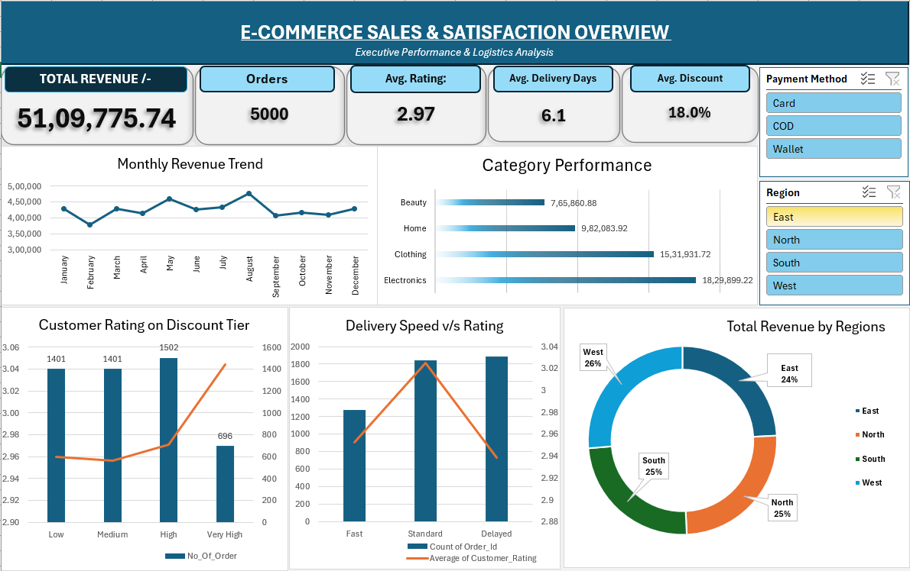

# E-Commerce Sales & Satisfaction Analysis (Excel Dashboard)

An interactive, end-to-end business intelligence dashboard built in Microsoft Excel analyzing 5,000 transaction records (~₹51.1 Lakhs gross revenue). The project models the relationship between fulfillment efficiency, discount elasticity, regional demand, and customer satisfaction.

---

## 📌 Executive Summary & Key Insights

* **Discounts Drive Volume, Not Satisfaction:** 
  * Peak transaction volumes occur within the **Medium (11–20%)** and **High (21–30%)** discount bands (~1,400–1,500 orders each).
  * Customer ratings remain nearly unchanged across tiers (**~2.96 to 3.04**), indicating promotional pricing boosts order volume without improving brand sentiment.
* **Fulfillment Bottlenecks Penalize Sentiment:**
  * Orders delivered within standard timelines maintained consistent customer scores, but orders delayed past **8+ days** experienced an operational drop in average ratings.
* **Category Revenue Dominance:**
  * **Electronics** is the top revenue generator at **₹18.30L (35.8%)**, followed by **Clothing** at **₹15.32L (30.0%)**. Beauty and Home account for the remaining share.
* **Geographic Distribution:**
  * Gross revenue is evenly split across regions: **West (26%)**, **North (25%)**, **South (25%)**, and **East (24%)**.

---

## 🛠️ Tech Stack & Methodology

* **Data Cleaning & ETL (Power Query):**
  * Removed duplicate transactions based on `order_id`.
  * Standardized casing and trimmed text values across categories, regions, and payment channels.
  * Resolved date parsing errors using locale-aware conversions.
  * Engineered conditional grouping columns:
    * `delivery_bucket`: Fast (1–3 days), Standard (4–7 days), Delayed (8+ days).
    * `discount_bracket`: Low (0–10%), Medium (11–20%), High (21–30%), Very High (>30%).
* **Analytical Architecture (Excel Data Model & Pivot Engine):**
  * Structured a dedicated calculation layer (`Calculations` tab) isolating 5 distinct Pivot Tables from the visualization layer.
  * Aggregated executive KPIs: Total Revenue, Total Volume, Average Rating, Mean Delivery Time, and Average Discount.
* **Visualization Layer (`Executive_Dashboard`):**
  * 2x2 grid layout featuring combo secondary-axis charts, category horizontal bars, and regional donut distribution.
  * Connected global multi-table slicers (`Region` and `Payment Method`) using Report Connections.
  * Dynamic formula-linked KPI summary cards.

---

## 🚀 How to Run the Project

1. Clone or download this repository.
2. Open the workbook in **Microsoft Excel 2016 or newer** (with Power Query / Data Model enabled).
3. Navigate to the **`Executive_Dashboard`** tab.
4. Use the **Region** and **Payment Method** slicers on the right panel to filter all metrics and visual trends in real time.
